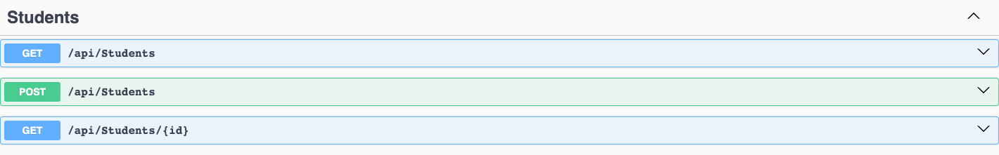
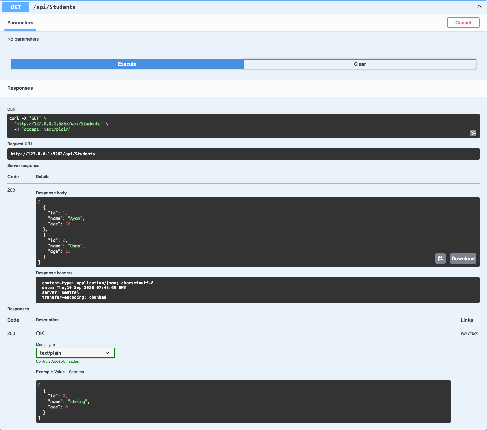
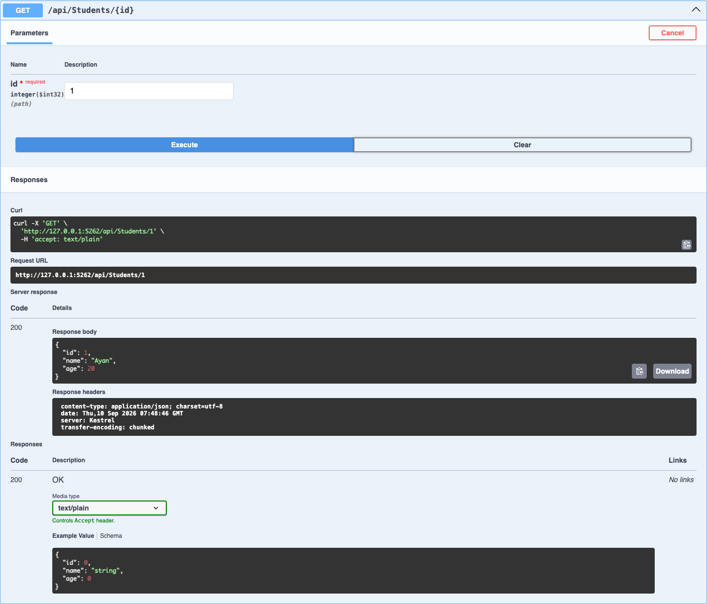
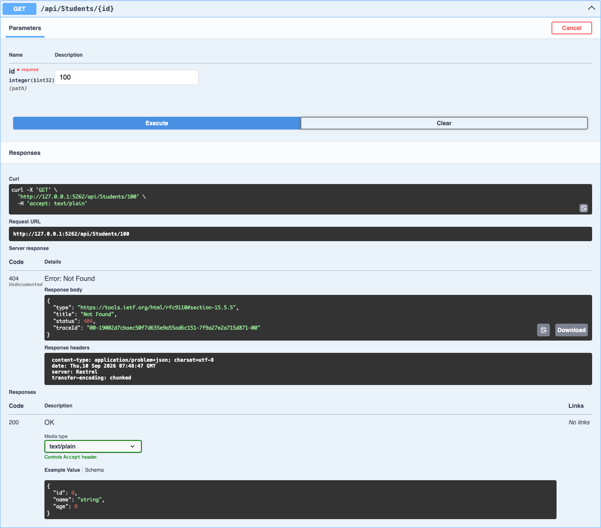
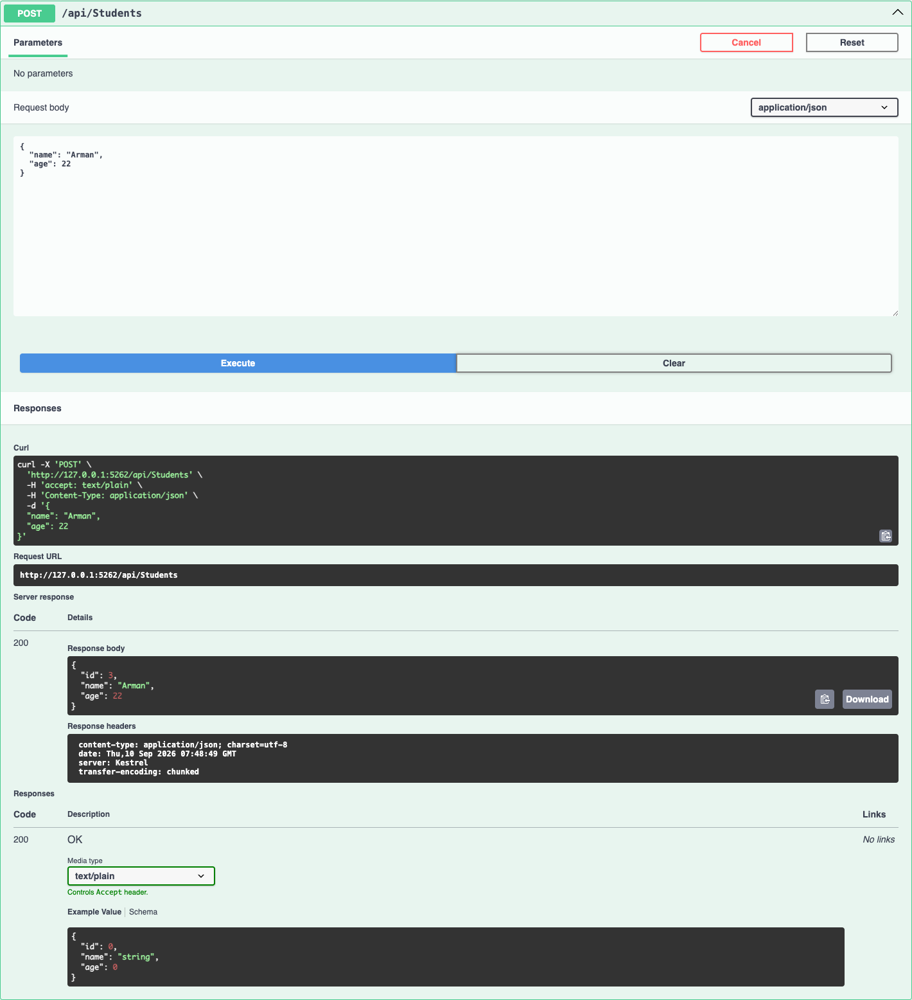
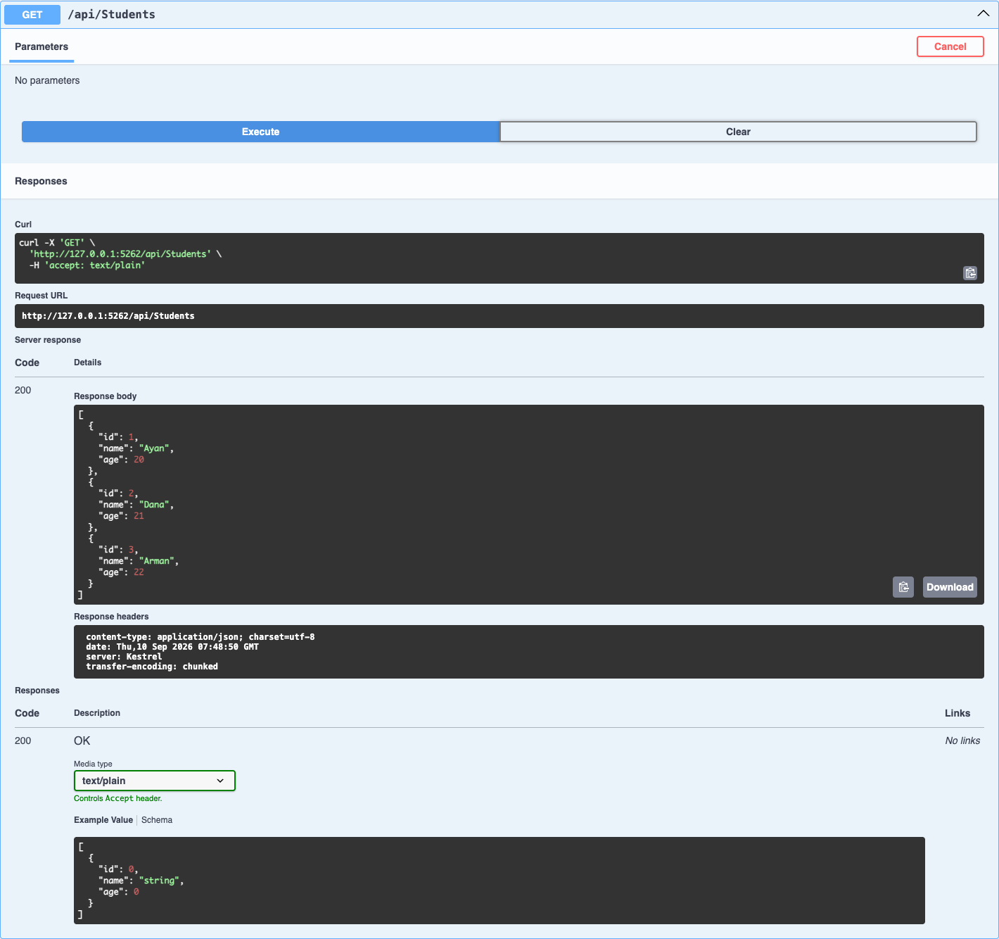

# Самостоятельная работа Модуль 01

## Тема

Введение в ASP.NET Core и первая конечная точка в API.

## Цель работы

Познакомиться с принципами работы Web API и научиться создавать простой веб-сервис на C# с использованием ASP.NET Core. Реализовать HTTP-запросы `GET` и `POST`, получить данные в формате JSON и проверить работу API через Swagger.

## Используемые технологии

- C#;
- .NET 8;
- ASP.NET Core Web API;
- Swagger и OpenAPI;
- хранение данных в памяти приложения.

## Модель данных

Основной ресурс системы — `Student`.

| Поле | Тип | Назначение |
|---|---|---|
| `Id` | `int` | Уникальный идентификатор студента |
| `Name` | `string` | Имя студента |
| `Age` | `int` | Возраст студента |

Пример объекта в формате JSON:

```json
{
  "id": 1,
  "name": "Ayan",
  "age": 20
}
```

## Реализованные endpoints

| HTTP Method | Endpoint | Назначение | Коды ответа |
|---|---|---|---|
| `GET` | `/api/students` | Получить список студентов | `200 OK` |
| `GET` | `/api/students/{id}` | Получить студента по идентификатору | `200 OK`, `404 Not Found` |
| `POST` | `/api/students` | Добавить нового студента | `200 OK` |

## Проверка через Swagger

### Доступные endpoints

Swagger отображает все три реализованные операции.



### Получение списка студентов

Запрос `GET /api/students` возвращает исходный список студентов и статус `200 OK`.



### Получение студента по идентификатору

Запрос `GET /api/students/1` возвращает студента Ayan и статус `200 OK`.



### Запрос отсутствующего студента

Запрос `GET /api/students/100` возвращает статус `404 Not Found`, поскольку студента с таким идентификатором нет.



### Добавление студента

Через `POST /api/students` отправлен новый студент:

```json
{
  "name": "Arman",
  "age": 22
}
```

Сервер присвоил студенту идентификатор `3` и вернул статус `200 OK`.



### Проверка результата добавления

После выполнения POST-запроса повторный запрос `GET /api/students` возвращает Ayan, Dana и Arman.



## Контрольные вопросы

### 1. Что такое Web API

Web API — это программный интерфейс, через который клиентские приложения взаимодействуют с сервером по сети. Клиент отправляет HTTP-запрос, а сервер обрабатывает его и возвращает ответ с данными.

### 2. Что такое HTTP-запрос

HTTP-запрос — это сообщение, которое клиент отправляет серверу. Оно содержит HTTP-метод, URL, заголовки и при необходимости тело с данными.

### 3. Что такое HTTP-ответ

HTTP-ответ — это сообщение сервера клиенту, содержащее статусный код, заголовки и при необходимости тело ответа.

### 4. Для чего используется метод GET

Метод `GET` используется для получения данных с сервера без изменения ресурса. Например, он позволяет получить список студентов или одного студента по идентификатору.

### 5. Для чего используется метод POST

Метод `POST` используется для отправки данных серверу и создания нового ресурса. В этой работе с его помощью добавляется новый студент.

### 6. Что означает код 200 OK

Код `200 OK` означает, что сервер успешно получил и обработал запрос.

### 7. Что означает код 404 Not Found

Код `404 Not Found` означает, что сервер не нашёл ресурс по указанному URL или идентификатору.

### 8. Что такое JSON

JSON — это текстовый формат представления и передачи структурированных данных. Он часто используется для обмена данными между клиентом и Web API.

### 9. Что такое endpoint

Endpoint — это точка доступа к определённой операции Web API. Она определяется сочетанием HTTP-метода и URL, например `GET /api/students`.

### 10. Для чего используется Swagger

Swagger используется для просмотра документации Web API и проверки endpoints через веб-интерфейс. Он позволяет отправлять запросы, указывать параметры и видеть ответы сервера.

## Результат работы

Разработан ASP.NET Core Web API с тремя операциями: получение списка студентов, получение студента по идентификатору и добавление нового студента. Все операции протестированы через Swagger, включая успешные ответы `200 OK` и ответ `404 Not Found` для отсутствующего студента.
