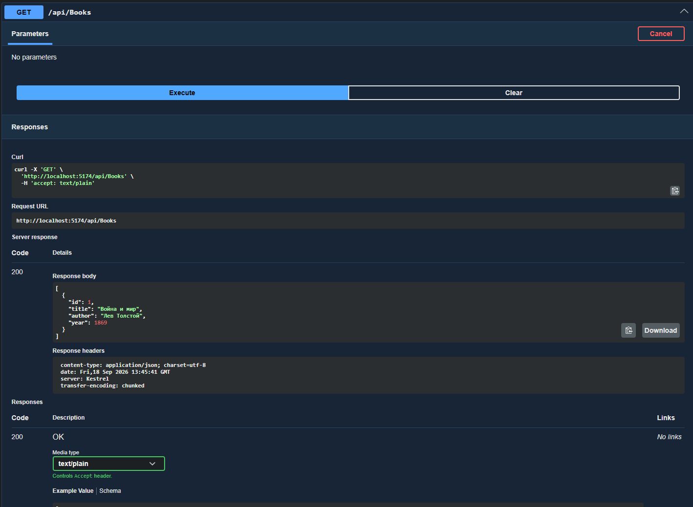
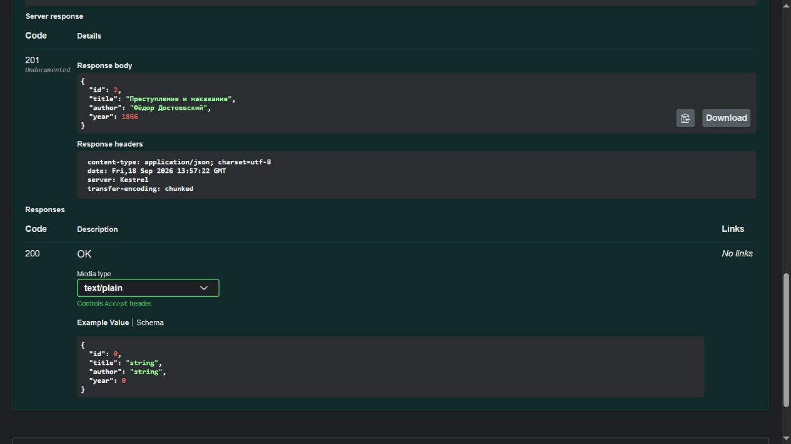

# Домашняя работа № 2. Web API для списка книг

## Задание

Создать проект ASP.NET Core Web API для управления списком книг. Книга должна содержать `Id`, `Title`, `Author` и `Year`. В контроллере `BooksController` реализовать получение всех книг через `GET /api/books` и добавление книги через `POST /api/books`. Хранить данные в обычном `List<Book>` без базы данных. Проверить оба запроса в Swagger и убедиться, что добавленная книга появляется в списке.

## Используемые технологии

- C# и .NET 10;
- ASP.NET Core Web API с контроллерами;
- OpenAPI и Swagger UI;
- хранение данных в памяти приложения (`List<Book>`).

## Структура проекта

| Файл | Назначение |
|---|---|
| `Models/Book.cs` | Модель книги с четырьмя свойствами |
| `Controllers/BooksController.cs` | Методы GET и POST для списка книг |
| `Program.cs` | Регистрация контроллеров, OpenAPI и Swagger UI |
| `WebApiHomework2.csproj` | Настройки проекта и пакеты NuGet |

## Модель данных

| Свойство | Тип | Назначение |
|---|---|---|
| `Id` | `int` | Идентификатор книги |
| `Title` | `string` | Название книги |
| `Author` | `string` | Автор книги |
| `Year` | `int` | Год издания |

Пример книги в формате JSON:

```json
{
  "id": 2,
  "title": "Преступление и наказание",
  "author": "Фёдор Достоевский",
  "year": 1866
}
```

## Реализованные методы API

| Метод | Адрес | Действие | Успешный ответ |
|---|---|---|---|
| `GET` | `/api/books` | Вернуть список книг | `200 OK` |
| `POST` | `/api/books` | Добавить книгу из JSON в список | `201 Created` |

Контроллер наследуется от `ControllerBase` и использует `[ApiController]` и `[Route("api/[controller]")]`. Атрибуты `[HttpGet]` и `[HttpPost]` задают HTTP-методы. В качестве начальных данных в список добавлена книга «Война и мир».

## Запуск проекта

Требуется установленный .NET 10 SDK. Откройте терминал в папке `WebApiHomework2` и выполните:

```powershell
dotnet restore
dotnet run --launch-profile http
```

Откройте Swagger UI по адресу <http://localhost:5174/swagger>. Приложение должно продолжать работать в терминале, пока выполняются запросы.

## Проверка через Swagger

### 1. Получение списка книг

В Swagger откройте `GET /api/Books`, нажмите **Try it out** и **Execute**. Сервер возвращает `200 OK` и начальный список с книгой «Война и мир».



### 2. Добавление книги

Откройте `POST /api/Books`, нажмите **Try it out**, введите JSON из раздела «Модель данных» и нажмите **Execute**. Сервер возвращает `201 Created` и добавленную книгу в теле ответа.



### 3. Повторная проверка списка

Снова выполните `GET /api/Books`. В ответе `200 OK` теперь две книги: «Война и мир» и «Преступление и наказание». Это подтверждает, что POST добавил книгу в общий список.

## Особенности хранения данных

Книги хранятся в статическом `List<Book>` в памяти приложения. База данных не используется. После остановки и повторного запуска API добавленная через POST книга исчезнет, а начальный список восстановится.

## Результат

Создан ASP.NET Core Web API с моделью `Book` и контроллером `BooksController`. Запросы GET и POST успешно проверены через Swagger: получены ответы `200 OK` и `201 Created`, а повторный GET показал добавленную книгу.
