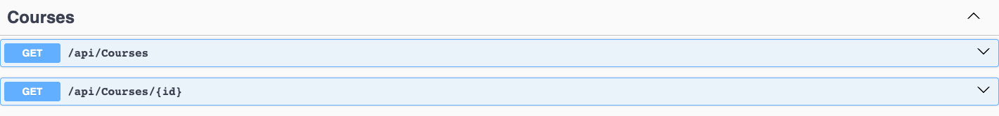
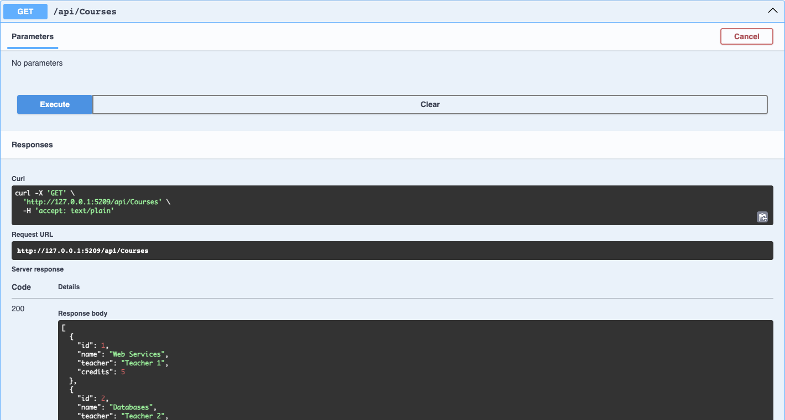
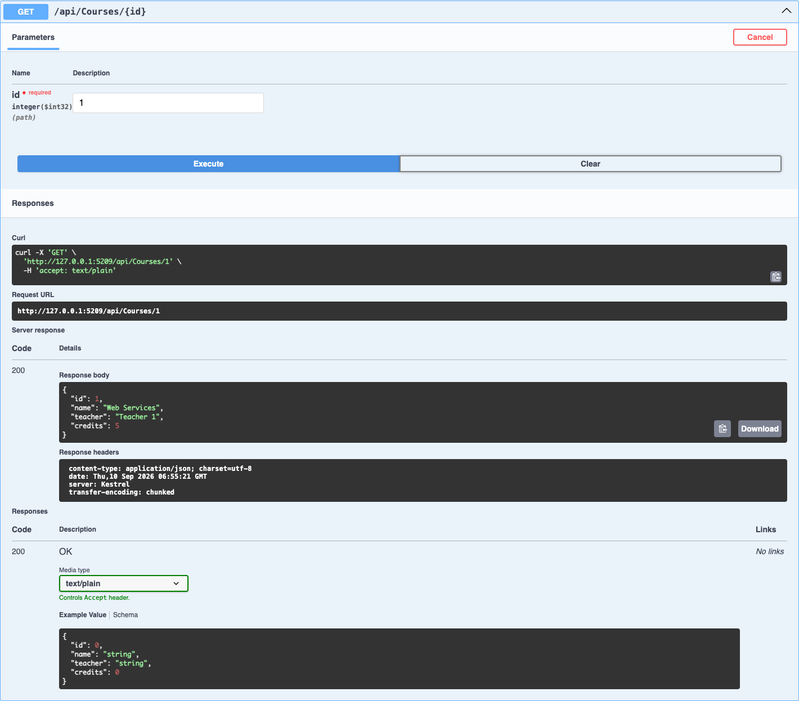
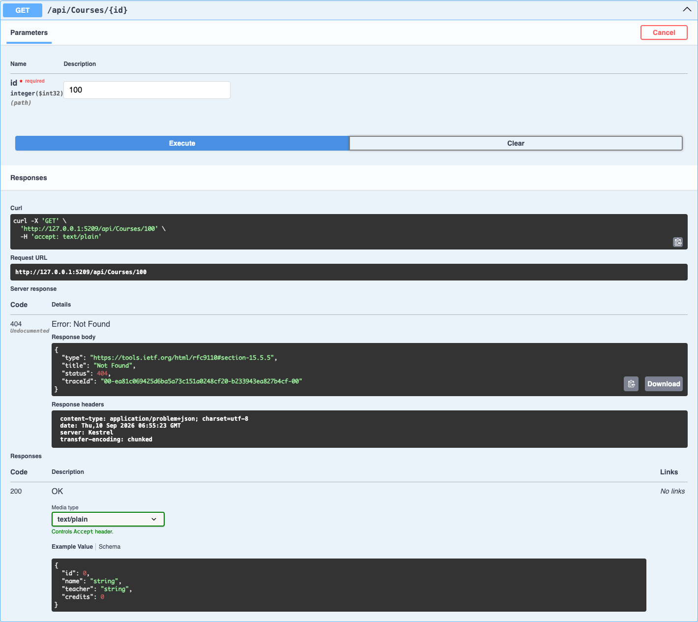

# Лабораторная работа Модуль 01

## Тема

Введение в ASP.NET Core и первая конечная точка в API.

## Цель работы

Познакомиться с принципами работы веб-сервисов и реализовать Web API на языке C# с использованием ASP.NET Core. Научиться создавать HTTP-endpoints, возвращать данные в формате JSON и проверять запросы через Swagger.

## Используемые технологии

- C#;
- .NET 8;
- ASP.NET Core Web API;
- Swagger и OpenAPI;
- хранение данных в памяти приложения без базы данных.

## Постановка задачи

Разработать простой веб-сервис для управления учебными курсами университета. Основным ресурсом системы является `Course`.

Модель курса содержит следующие поля:

| Поле | Тип | Назначение |
|---|---|---|
| `Id` | `int` | Уникальный идентификатор курса |
| `Name` | `string` | Название курса |
| `Teacher` | `string` | Преподаватель курса |
| `Credits` | `int` | Количество кредитов |

Пример объекта в формате JSON:

```json
{
  "id": 1,
  "name": "Web Services",
  "teacher": "Teacher 1",
  "credits": 5
}
```

## Реализованные endpoints

| HTTP Method | URL | Назначение | Возможные коды ответа |
|---|---|---|---|
| `GET` | `/api/courses` | Получить список всех курсов | `200 OK` |
| `GET` | `/api/courses/{id}` | Получить курс по идентификатору | `200 OK`, `404 Not Found` |

Данные хранятся в статическом списке `courses` внутри контроллера. После перезапуска приложения список возвращается в исходное состояние.

## Проверка через Swagger

### Доступные endpoints



### Получение всех курсов

Запрос `GET /api/courses` успешно возвращает список курсов и статус `200 OK`.



### Получение существующего курса

Запрос `GET /api/courses/1` возвращает найденный курс и статус `200 OK`.



### Запрос отсутствующего курса

Запрос `GET /api/courses/100` возвращает статус `404 Not Found`, поскольку курса с таким идентификатором нет.



## Почему API возвращает 404, а не пустой объект

Код `404 Not Found` однозначно сообщает клиенту, что ресурс с указанным идентификатором не существует. Пустой объект мог бы быть ошибочно воспринят как существующий курс без заполненных данных. Статусный код позволяет клиентскому приложению правильно обработать ситуацию, например показать пользователю сообщение о том, что курс не найден.

## Контрольные вопросы

### 1. Что такое Web API

Web API — это программный интерфейс, через который приложения обмениваются данными по сети с помощью HTTP-запросов и HTTP-ответов.

### 2. Чем Web API отличается от обычной веб-страницы

Обычная веб-страница возвращает пользователю готовое визуальное представление в виде HTML. Web API обычно возвращает структурированные данные, например JSON, которые затем обрабатывает другое приложение.

### 3. Что такое клиент-серверная архитектура

Это модель взаимодействия, в которой клиент отправляет запросы, а сервер принимает их, выполняет необходимую обработку и возвращает результат.

### 4. Что такое HTTP Request

HTTP Request — это запрос клиента к серверу. Он содержит HTTP-метод, URL, заголовки и при необходимости тело с данными.

### 5. Что такое HTTP Response

HTTP Response — это ответ сервера клиенту. Он содержит статусный код, заголовки и при необходимости тело ответа с данными.

### 6. Что такое endpoint

Endpoint — это доступная точка Web API, которая определяется URL и HTTP-методом и выполняет конкретную операцию.

### 7. Для чего используется HTTP GET

Метод `GET` используется для получения данных с сервера без изменения ресурса.

### 8. Для чего используется POST

Метод `POST` используется для передачи данных серверу и создания нового ресурса.

### 9. В чём отличие PUT от POST

`POST` обычно создаёт новый ресурс, а `PUT` полностью обновляет существующий ресурс по известному URL или идентификатору.

### 10. Для чего используется DELETE

Метод `DELETE` используется для удаления ресурса на сервере.

### 11. Что означает HTTP Status Code 200

`200 OK` означает, что сервер успешно обработал запрос и вернул результат.

### 12. Что означает 201

`201 Created` означает, что сервер успешно создал новый ресурс.

### 13. Что означает 204

`204 No Content` означает, что запрос выполнен успешно, но сервер не возвращает тело ответа. Такой код часто используется после успешного обновления или удаления.

### 14. Что означает 404

`404 Not Found` означает, что сервер не нашёл запрашиваемый ресурс.

### 15. Что такое JSON

JSON — это текстовый формат представления и передачи структурированных данных в виде объектов, свойств и значений.

### 16. Что делает атрибут HttpGet

Атрибут `[HttpGet]` указывает, что метод контроллера обрабатывает входящие HTTP-запросы типа `GET`.

### 17. Для чего используется Route

Атрибут `[Route]` задаёт шаблон URL, по которому клиент может обратиться к контроллеру или его методу.

### 18. Что делает ControllerBase

`ControllerBase` предоставляет базовые возможности для создания API-контроллеров, включая методы `Ok()`, `NotFound()`, `BadRequest()` и другие способы формирования HTTP-ответов.

### 19. Что такое Swagger

Swagger — это инструмент для просмотра документации Web API и выполнения тестовых HTTP-запросов через веб-интерфейс.

### 20. Почему Web API удобно использовать для взаимодействия нескольких информационных систем

Web API предоставляет единые и понятные правила обмена данными через HTTP. Благодаря этому системы, написанные на разных языках и работающие на разных платформах, могут взаимодействовать друг с другом.

## Результат работы

Создан ASP.NET Core Web API для учебных курсов. Реализовано получение списка всех курсов и получение одного курса по идентификатору. Проверены успешные ответы `200 OK` и обработка отсутствующего ресурса с ответом `404 Not Found`.
