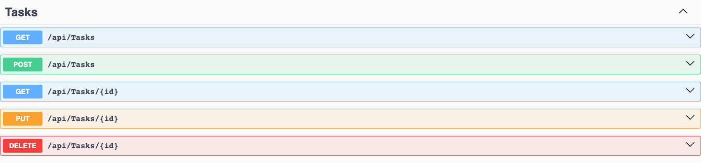
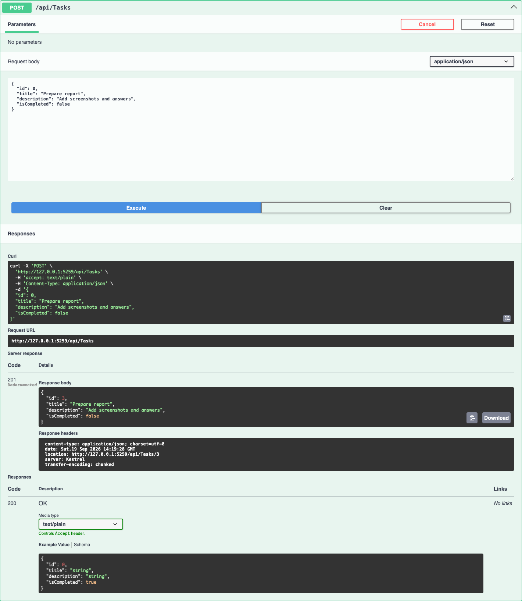
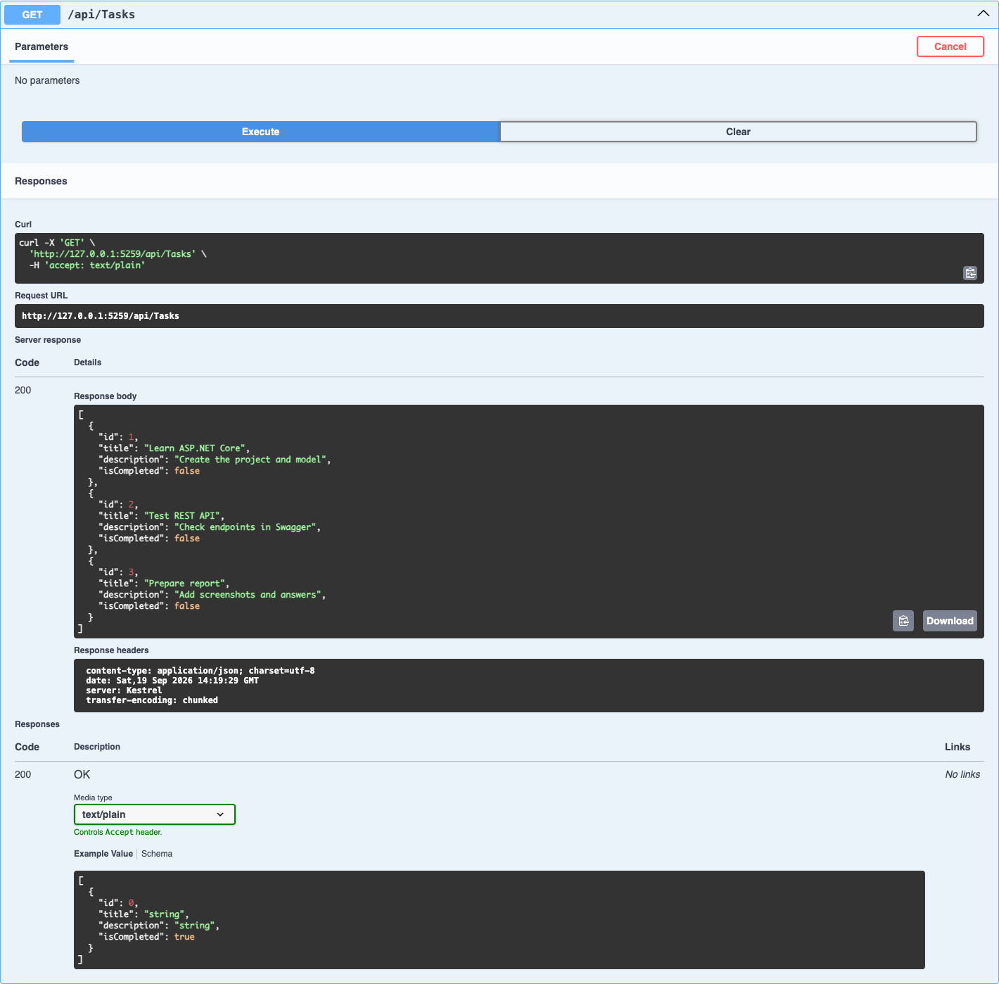
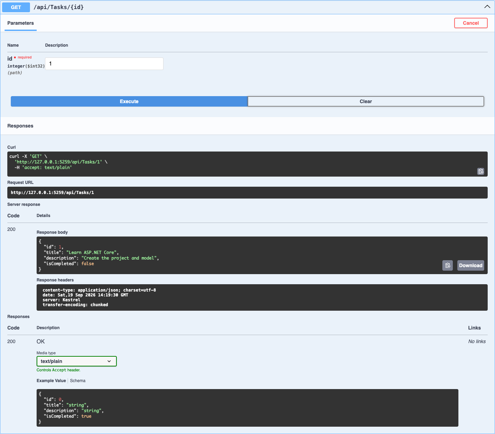
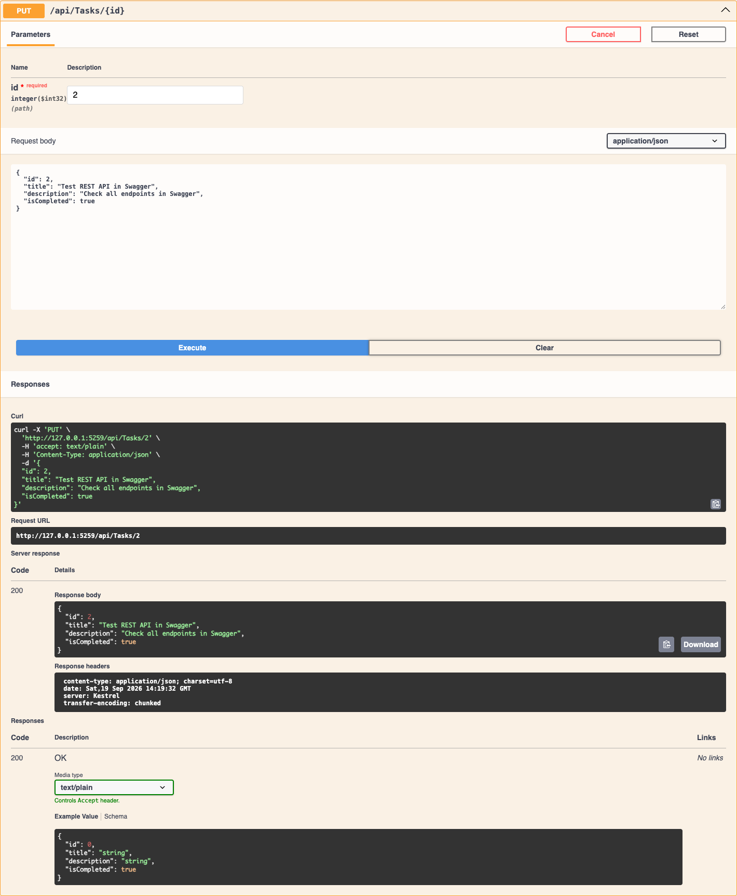
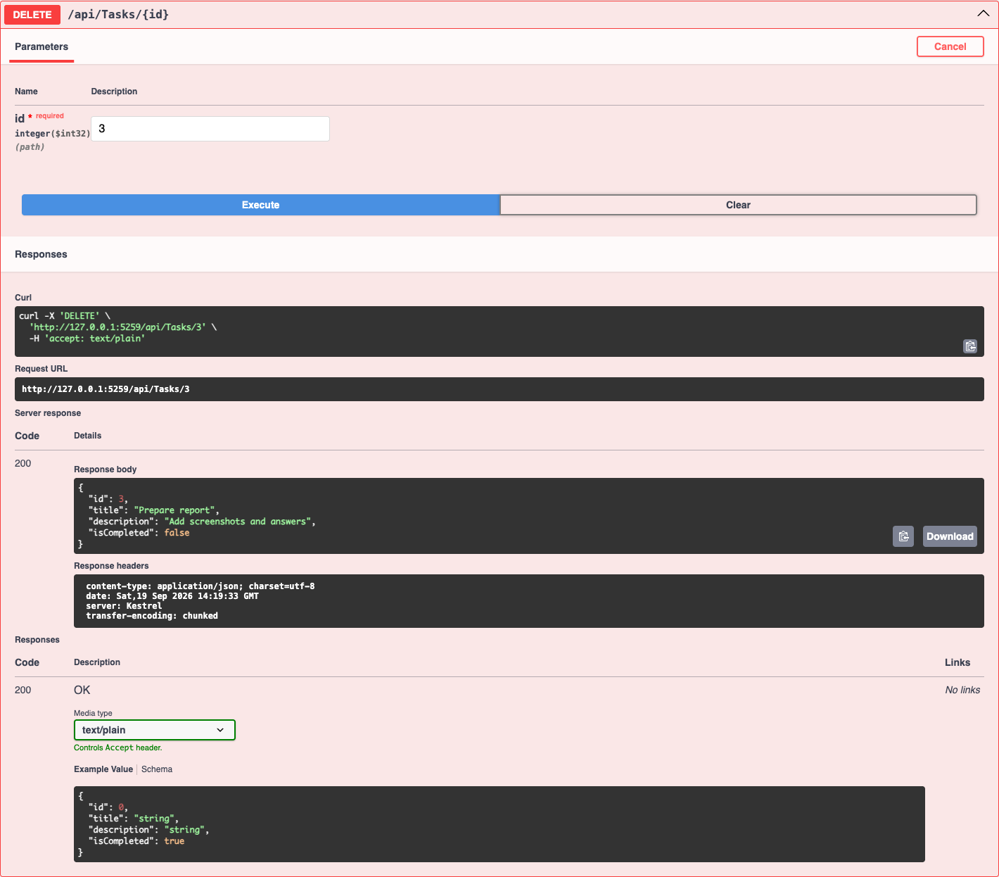
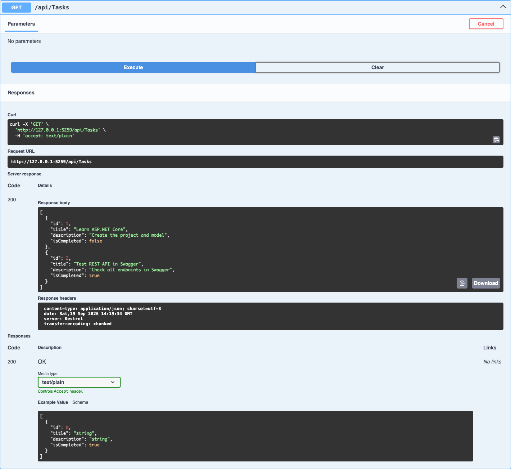
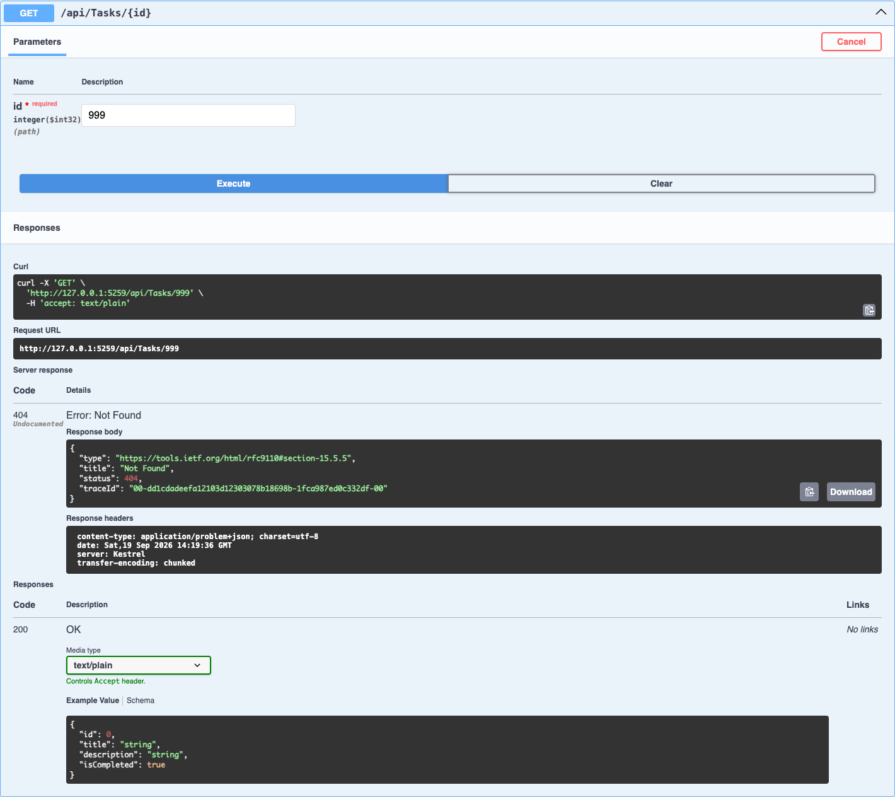
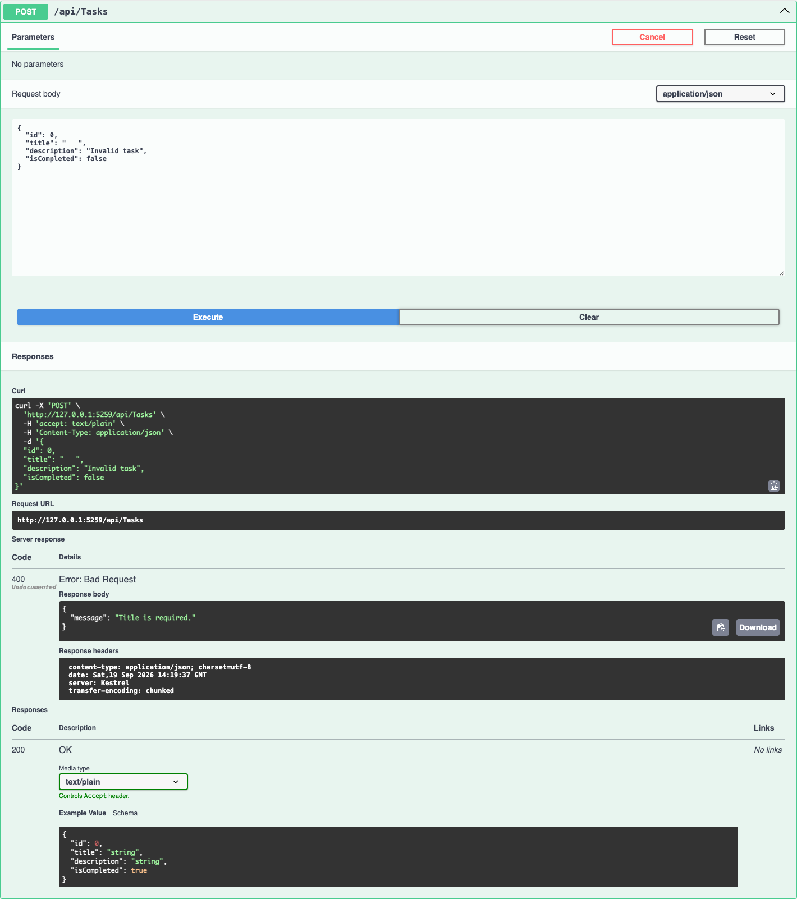

# Лабораторная работа Модуль 02

## Тема

Реализация веб-сервиса с применением ASP.NET Core.

## Цель работы

Получить практические навыки создания Web API на ASP.NET Core, работы с контроллерами, маршрутизацией, HTTP-методами и тестирования API с помощью Swagger.

## Используемые технологии

- C#;
- .NET 8;
- ASP.NET Core Web API;
- Controllers;
- Swagger и OpenAPI;
- хранение данных в памяти приложения.

База данных в проекте не используется. Все задачи хранятся в `List<TaskItem>` и сбрасываются после перезапуска приложения.

## Модель данных

Основной ресурс системы — `TaskItem`.

| Поле | Тип | Назначение |
|---|---|---|
| `Id` | `int` | Уникальный идентификатор задачи |
| `Title` | `string` | Название задачи |
| `Description` | `string` | Описание задачи |
| `IsCompleted` | `bool` | Признак выполнения задачи |

Пример объекта:

```json
{
  "id": 1,
  "title": "Learn ASP.NET Core",
  "description": "Create the project and model",
  "isCompleted": false
}
```

## Реализованные endpoints

| HTTP Method | Маршрут | Назначение | Коды ответа |
|---|---|---|---|
| `GET` | `/api/tasks` | Получить все задачи | `200 OK` |
| `GET` | `/api/tasks/{id}` | Получить задачу по идентификатору | `200 OK`, `404 Not Found` |
| `POST` | `/api/tasks` | Создать новую задачу | `201 Created`, `400 Bad Request` |
| `PUT` | `/api/tasks/{id}` | Изменить существующую задачу | `200 OK`, `400 Bad Request`, `404 Not Found` |
| `DELETE` | `/api/tasks/{id}` | Удалить задачу | `200 OK`, `404 Not Found` |

Название задачи обязательно. Если `Title` пустой или содержит только пробелы, сервер возвращает `400 Bad Request`.

## Запуск проекта

```bash
dotnet run
```

После запуска адрес Swagger отображается в терминале. Для текущего профиля используется:

```text
http://localhost:5259/swagger/index.html
```

## Тестирование через Swagger

### Список реализованных методов

Swagger отображает пять REST-операций.



### Создание трёх задач

Через `POST /api/tasks` последовательно созданы три задачи. При создании сервер самостоятельно присваивает идентификатор и возвращает `201 Created`.



### Получение списка задач

Запрос `GET /api/tasks` возвращает три созданные задачи и код `200 OK`.



### Получение одной задачи

Запрос `GET /api/tasks/1` возвращает задачу с идентификатором `1` и код `200 OK`.



### Изменение задачи

Запрос `PUT /api/tasks/2` изменяет название, описание и статус второй задачи. Сервер возвращает обновлённый объект и код `200 OK`.



### Удаление задачи

Запрос `DELETE /api/tasks/3` удаляет третью задачу и возвращает код `200 OK`.



### Проверка результата

Повторный запрос `GET /api/tasks` показывает, что вторая задача обновлена, а третья удалена.



### Проверка 404 Not Found

Запрос несуществующей задачи `GET /api/tasks/999` возвращает `404 Not Found`.



### Проверка 400 Bad Request

Попытка создать задачу с пустым названием возвращает `400 Bad Request`.



## Контрольные вопросы

### 1. Что такое Web API

Web API — это программный интерфейс, через который клиентские приложения взаимодействуют с сервером по HTTP. Клиент отправляет запрос, а сервер выполняет операцию и возвращает статусный код и данные, обычно в формате JSON.

### 2. Для чего используется атрибут ApiController

Атрибут `[ApiController]` обозначает класс как API-контроллер. Он включает поведение, удобное для Web API: автоматическую проверку входных данных, привязку параметров запроса и формирование ответа `400 Bad Request` при ошибках модели.

### 3. Для чего используется Route

Атрибут `[Route]` задаёт шаблон URL для контроллера или отдельного метода. В этом проекте `[Route("api/[controller]")]` формирует базовый адрес `/api/tasks` из имени `TasksController`.

### 4. Чем отличаются методы GET и POST

`GET` используется для получения существующих данных и не должен изменять состояние ресурса. `POST` передаёт данные серверу и обычно создаёт новый ресурс.

### 5. Чем отличаются PUT и DELETE

`PUT` изменяет существующий ресурс по его идентификатору. `DELETE` удаляет ресурс с указанным идентификатором.

### 6. Что означают HTTP-коды 200, 201, 400 и 404

- `200 OK` — запрос успешно выполнен;
- `201 Created` — новый ресурс успешно создан;
- `400 Bad Request` — клиент передал некорректные данные;
- `404 Not Found` — запрашиваемый ресурс не найден.

## Результат работы

Создан REST API для управления списком задач. API позволяет создавать, получать, изменять и удалять задачи. Все методы и требуемые HTTP-коды проверены через Swagger, а результаты тестирования сохранены в папке `screenshots`.
