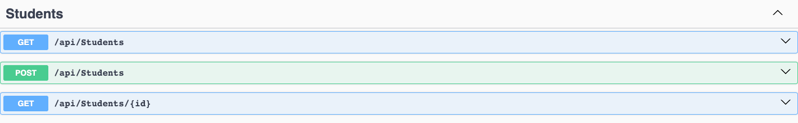
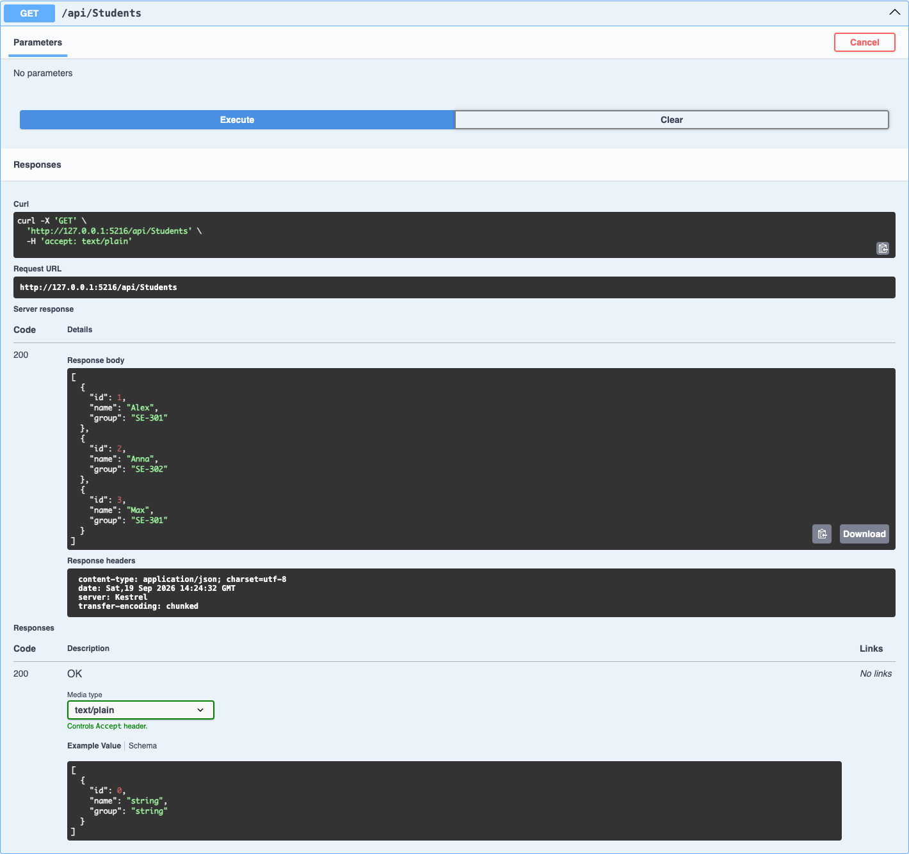
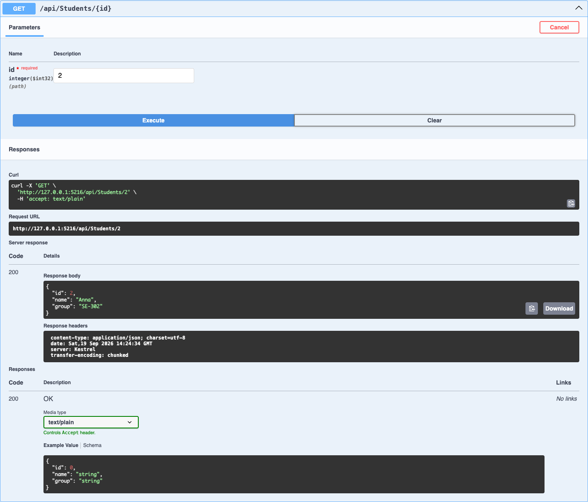
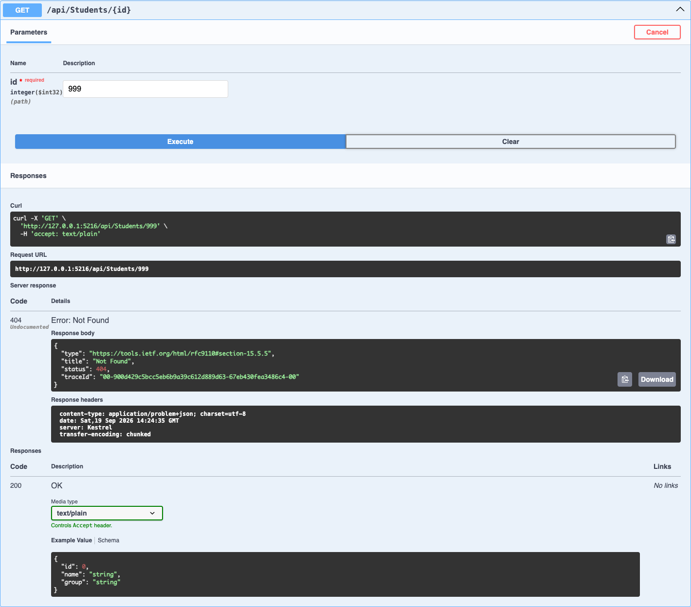
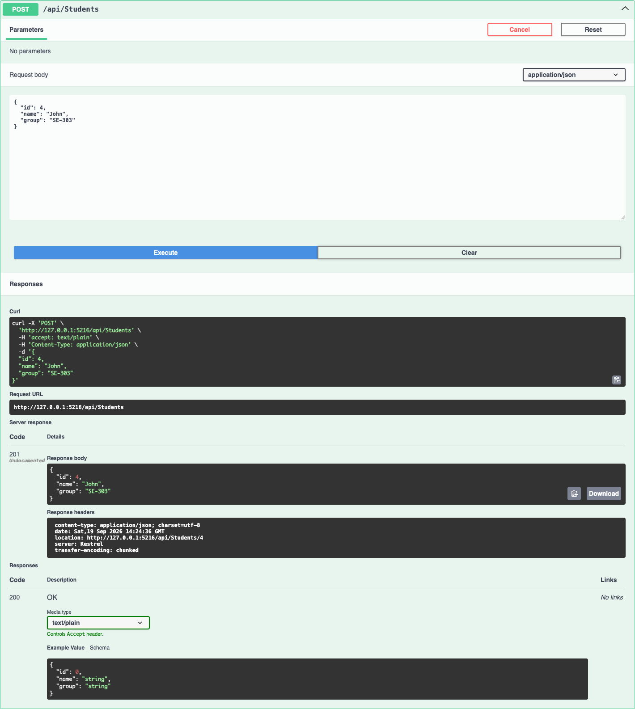
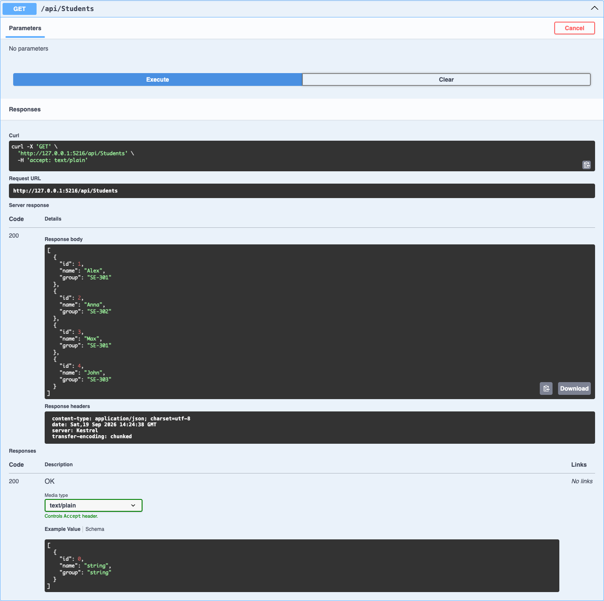

# Практическая работа Модуль 02

## Тема

Реализация веб-сервиса с применением ASP.NET Core.

## Цель работы

Научиться создавать проект ASP.NET Core Web API, работать с контроллерами, маршрутизацией и HTTP-методами `GET` и `POST`, а также тестировать API через Swagger.

## Используемые технологии

- C#;
- .NET 8;
- ASP.NET Core Web API;
- Controllers;
- Swagger и OpenAPI;
- хранение данных в памяти приложения.

## Модель данных

Основной ресурс API — `Student`.

| Поле | Тип | Назначение |
|---|---|---|
| `Id` | `int` | Уникальный идентификатор студента |
| `Name` | `string` | Имя студента |
| `Group` | `string` | Учебная группа студента |

Пример объекта:

```json
{
  "id": 1,
  "name": "Alex",
  "group": "SE-301"
}
```

## Тестовые данные

При запуске приложения список уже содержит трёх студентов:

| Id | Имя | Группа |
|---:|---|---|
| 1 | Alex | SE-301 |
| 2 | Anna | SE-302 |
| 3 | Max | SE-301 |

Данные хранятся в статическом `List<Student>` и возвращаются к исходному состоянию после перезапуска приложения.

## Реализованные endpoints

| HTTP Method | Маршрут | Назначение | Коды ответа |
|---|---|---|---|
| `GET` | `/api/students` | Получить список всех студентов | `200 OK` |
| `GET` | `/api/students/{id}` | Получить студента по идентификатору | `200 OK`, `404 Not Found` |
| `POST` | `/api/students` | Добавить нового студента | `201 Created`, `400 Bad Request` |

Метод `POST` проверяет заполнение имени и группы, а также запрещает создание двух студентов с одинаковым `Id`.

## Запуск проекта

```bash
dotnet run
```

После запуска Swagger доступен по адресу, указанному в терминале. Для текущего профиля:

```text
http://localhost:5216/swagger/index.html
```

## Проверка через Swagger

### Реализованные методы

Swagger показывает две операции `GET` и одну операцию `POST`.



### Получение всех студентов

Запрос `GET /api/students` возвращает трёх студентов и код `200 OK`.



### Получение студента по идентификатору

Запрос `GET /api/students/2` возвращает информацию о студенте Anna.



### Проверка отсутствующего идентификатора

Запрос `GET /api/students/999` возвращает код `404 Not Found`.



### Добавление студента

Через `POST /api/students` отправлен новый студент:

```json
{
  "id": 4,
  "name": "John",
  "group": "SE-303"
}
```

Сервер добавил студента и вернул код `201 Created`.



### Проверка результата добавления

Повторный запрос `GET /api/students` возвращает четырёх студентов, включая John.



## Контрольные вопросы

### 1. Что такое Web API

Web API — это программный интерфейс, через который клиент обращается к серверу по HTTP. Сервер принимает запрос, выполняет необходимую операцию и возвращает статусный код и данные, обычно в формате JSON.

### 2. Для чего нужен ControllerBase

`ControllerBase` — это базовый класс для API-контроллеров. Он предоставляет методы для формирования HTTP-ответов, например `Ok()`, `NotFound()`, `BadRequest()` и `CreatedAtAction()`.

### 3. Что делает атрибут ApiController

Атрибут `[ApiController]` обозначает класс как API-контроллер и включает автоматическую привязку входных данных, проверку модели и удобную обработку ошибок запроса.

### 4. Для чего используется Route

Атрибут `[Route]` задаёт шаблон URL, по которому доступен контроллер. Маршрут `[Route("api/[controller]")]` преобразуется в `/api/students` для класса `StudentsController`.

### 5. В чём разница между GET и POST

`GET` используется для получения существующих данных и не должен изменять состояние ресурса. `POST` отправляет данные серверу и обычно создаёт новый ресурс.

### 6. Что означает HTTP-код 404 Not Found

Код `404 Not Found` означает, что сервер не нашёл запрашиваемый ресурс. В этом проекте он возвращается, если студента с указанным `Id` нет в списке.

## Результат работы

Создан ASP.NET Core Web API для хранения информации о студентах. Реализованы получение списка студентов, поиск студента по идентификатору и добавление нового студента. Работа endpoints и ответ `404 Not Found` проверены через Swagger.
